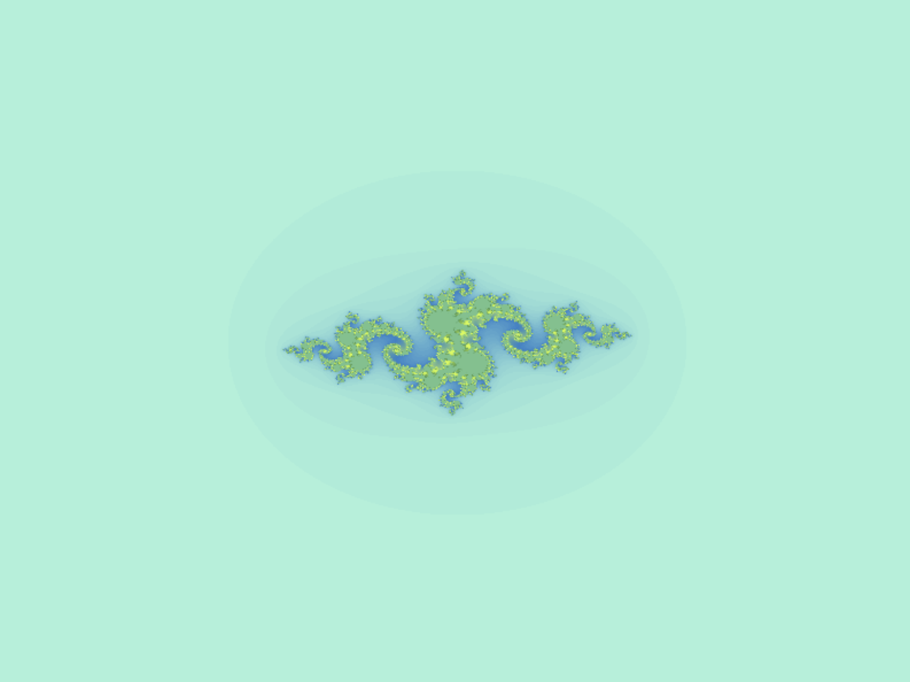
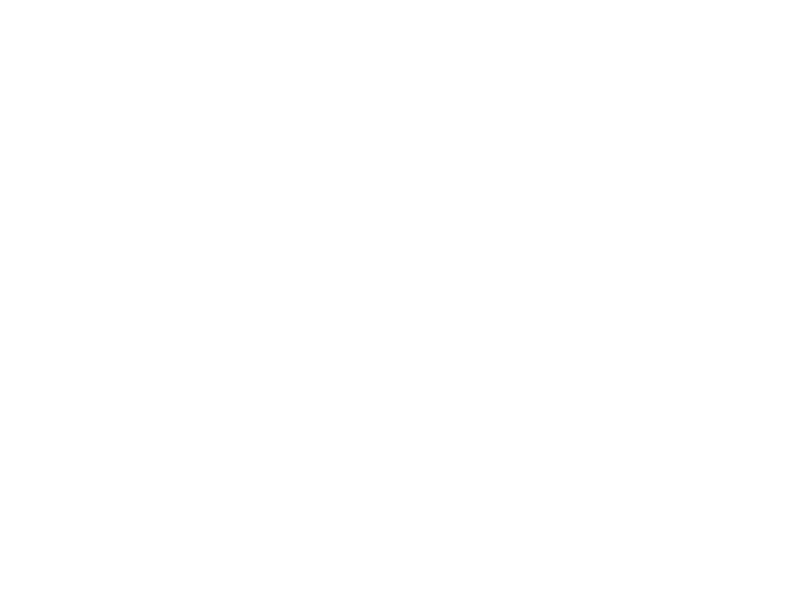
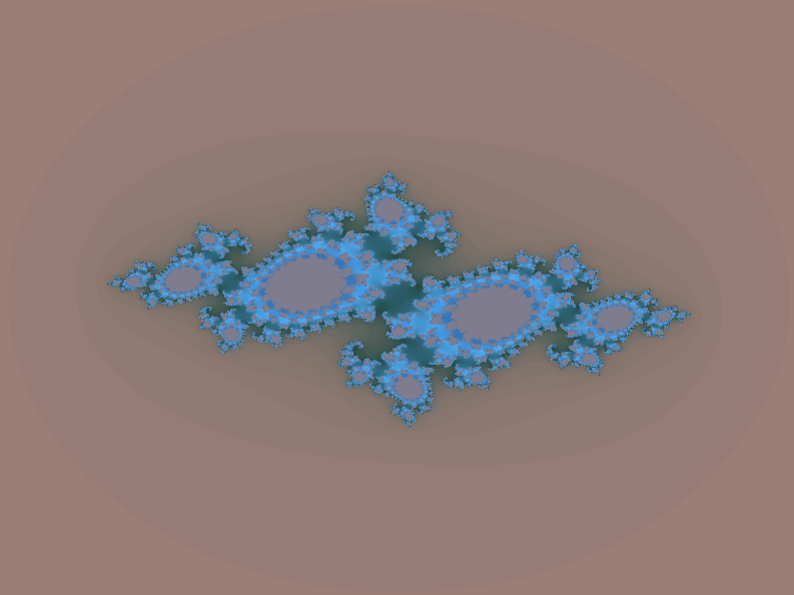

---

# Julia Set Renderer

This project is a multi-threaded fractal (Julia set) renderer using SDL2 for window management and rendering, and [xsimd](https://github.com/xtensor-stack/xsimd) for SIMD (Single Instruction, Multiple Data) vectorized computations.

The renderer splits the calculation work between multiple worker threads and uses a continuous pixel buffer updated via an SDL streaming texture. The fractal parameters and gradient colors are configured via a central `Parameters` namespace.

---

## Example fractals





---

## Table of Contents

- [Project Structure](#project-structure)
- [Prerequisites](#prerequisites)
- [Building](#building)
- [Usage](#usage)
- [Code Overview](#code-overview)
  - [Parameters](#parameters)
  - [Renderer](#renderer)
    - [Core Methods](#core-methods)
    - [Multi-threading and Synchronization](#multi-threading-and-synchronization)
    - [SIMD Computation](#simd-computation)
  - [Window](#window)
- [Extending & Testing](#extending--testing)
- [License](#license)

---

## Project Structure

```
.
├── Parameters.hpp       # Global rendering and fractal parameters
├── Renderer.hpp         # Declaration of the Renderer class
├── Renderer.cpp         # Implementation of the fractal rendering, threading, and SIMD computations
├── Window.hpp           # Declaration of the Window class that wraps SDL_Window and Renderer
├── Window.cpp           # Implementation of the Window class, including the main event loop
└── main.cpp             # Entry point: initializes a Window object and starts the application
```

---

## Prerequisites

- **SDL2:** The project uses the SDL2 library for window creation, input handling, and 2D rendering.
- **xsimd:** The SIMD vectorization library ([xsimd GitHub repository](https://github.com/xtensor-stack/xsimd)).
- **C++17:** The code requires a C++17-compliant compiler.
- **Threads & Standard Library:** Utilizes the C++ standard library threading features (`<thread>`, `<mutex>`, `<condition_variable>`, etc.).

---

## Building


```bash
mkdir build && cd build
cmake ..
cmake --build .
```

---

## Usage

Run the compiled executable (e.g., `julia_renderer`). Controls inside the rendered window include:

- **Arrow Keys:** Pan the view.
  - **Up:** Pan up.
  - **Down:** Pan down.
  - **Left:** Pan left.
  - **Right:** Pan right.
- **Zoom:**
  - **Equals (`=`):** Zoom in.
  - **Minus (`-`):** Zoom out.
- **Julia Set Constant Adjustments:**
  - **W / S:** Increase / decrease the imaginary part (`C_IMAG`).
  - **A / D:** Decrease / increase the real part (`C_REAL`).
- **Regenerate Gradient:** Press **R** to generate a new color gradient.
- **Save Screenshot:** Press **F** to save a screenshot as a BMP file (filename based on the current time).
- **Escape:** Press **ESC** to exit the application.

Each frame, after processing input events, the fractal is re-rendered to reflect the updated parameters.

---

## Code Overview

### Parameters

Defined in `Parameters.hpp`, the `Parameters` namespace holds all the global constants controlling the rendering and fractal computation:

```cpp
namespace Parameters {
    inline int WIDTH = 800;           // Window width
    inline int HEIGHT = 600;          // Window height
    inline float CENTER_X = 400.0f;   // Center x-coordinate (width / 2)
    inline float CENTER_Y = 300.0f;   // Center y-coordinate (height / 2)
    inline float ZOOM = 1.0f;         // Zoom level
    inline int MAX_ITERATIONS = 100;  // Max iterations for fractal computation
    inline float C_REAL = -0.8f;      // Real part of Julia set constant c
    inline float C_IMAG = 0.156f;     // Imaginary part of Julia set constant c
    inline float ESCAPE_RADIUS_SQ = 4.0f; // Escape radius squared
    inline float TWO_MULTIPLIER = 2.0f;   // Multiplier for imaginary part
}
```

---

### Renderer

#### Core Methods

- **Constructor & Destructor:**  
  The `Renderer` constructor initializes the SDL renderer and texture, allocates a flat pixel buffer, and spawns worker threads according to the number of available hardware cores. The destructor ensures all threads are joined and SDL resources are destroyed.

- **init():**  
  Creates the SDL_Renderer and SDL_Texture, then calls `generateGradient()` to populate the color lookup table.

- **drawFractal():**  
  Breaks the screen vertically into chunks, enqueues tasks for worker threads, waits for their completion (using condition variables for synchronization), updates the texture with the pixel buffer, and renders it using SDL.

- **saveScreenshot():**  
  Captures the current pixel buffer to an SDL_Surface and saves it as a BMP file with a timestamped filename.

#### Multi-threading and Synchronization

- **Worker Threads:**  
  Each worker thread waits (using a condition variable) for tasks to become available from a shared queue. Once a task is dequeued, the thread computes the fractal for its chunk (i.e., a horizontal slice) and increments the `tasksCompleted` count.

- **Condition Variables:**  
  Synchronization is managed with a condition variable, avoiding spin-loops. The main thread waits until all tasks are processed before updating the texture and rendering.

#### SIMD Computation

- **computeSIMDIterations():**  
  Uses xsimd to vectorize the iterative fractal computation across multiple pixels in parallel. It includes an early exit if all lanes (vector elements) have met the escape condition.
  
- **computeSIMDChunk():**  
  Prepares coordinate data in a stack-allocated array and performs vectorized computations, storing the results into the pixel buffer.
  
- **computeScalarPixel():**  
  A fallback scalar method for computing pixels when SIMD is not applicable.

---

### Window

The `Window` class (declared in `Window.hpp` and defined in `Window.cpp`) handles:

- **SDL_Window Management:**  
  Creating, updating, and destroying the SDL window.
  
- **Event Loop (mainLoop()):**  
  Processing SDL events such as key presses to update parameters (panning, zooming, adjusting the Julia set constant).
  
- **Fractal Redrawing:**  
  After processing input events, the fractal is redrawn by calling the renderer’s `drawFractal()` method.

---