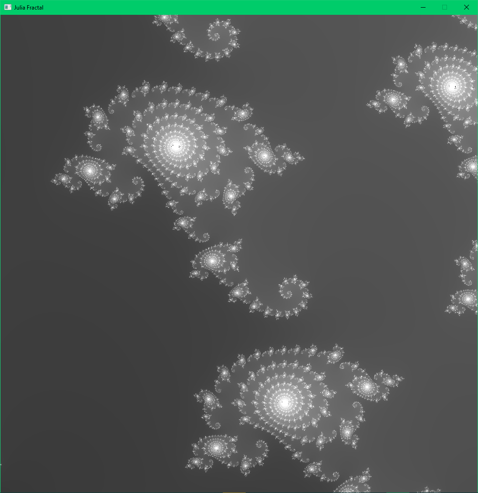

# x64 Interactive program displaying Julia fractal by Tomasz Okoń

# Requirements
-   Intel x64 architecture processor
-   CMake 3.29 or newer
-   C compiler supporting C 17
-   Windows system (assembly function is using microsoft x64 calling convention)
-   Git

# Installation
-   Clone the repository into desired place
-   Create "build" directory inside the repo
-   Using command prompt (terminal, powershell ...) go to the build directory with "cd (path)" command
-   Type cmake ..
-   Type cd ..
-   Type cmake --build (build directory)
-   After the installation program should be located in {repo}/executables or {repo}/exectubales/Debug
-   To run the program simply type "./Fractal.exe {width} {height}" in terminal while being in the same
    directory as the program, where {width} and {height} are desired width and height of the window.
    If program is executed without width and height arguments it sets both to 800.

# Using the program
-   Press c to toggle colored mode
-   Use arrows to change the fractal (modify C value)
-   Use mousewheel to zoom in/out
-   Use delete key to restore to default settings
-   Press left mouse button and drag the mouse to move around the fractal

# Fractal examples:

