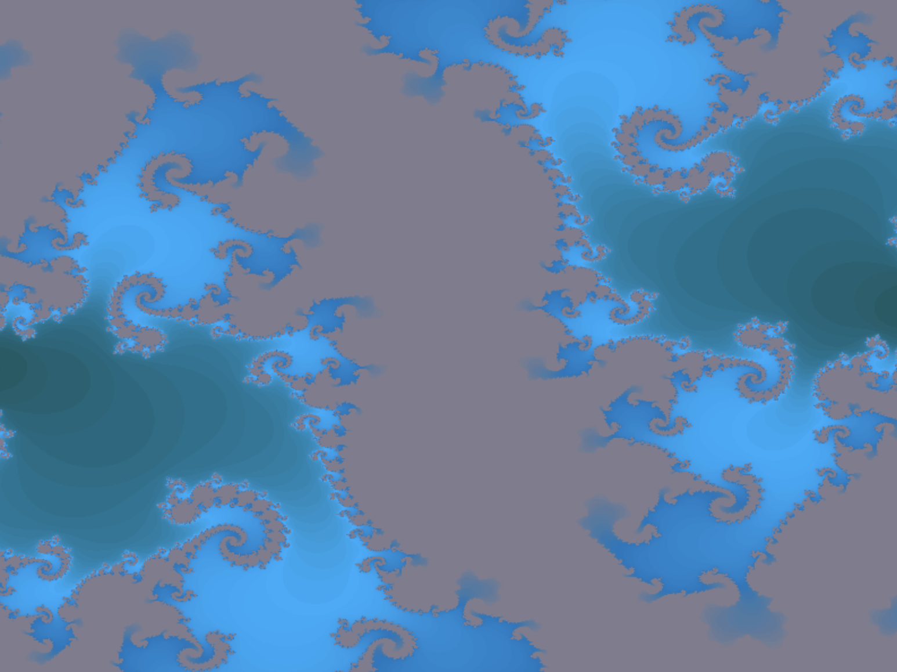

---

# Julia Set Renderer

This project is a multi-threaded fractal (Julia set) renderer using SDL2 for window management and rendering, and [xsimd](https://github.com/xtensor-stack/xsimd) for SIMD (Single Instruction, Multiple Data) vectorized computations.

The renderer splits the calculation work between multiple worker threads and uses a continuous pixel buffer updated via an SDL streaming texture. The fractal parameters and gradient colors are configured via a central `Parameters` namespace.

---

## Example fractals





---

## Table of Contents

- [Project Structure](#project-structure)
- [Prerequisites](#prerequisites)
- [Building](#building)
- [Usage](#usage)
- [Code Overview](#code-overview)
  - [Parameters](#parameters)
  - [Renderer](#renderer)
    - [Core Methods](#core-methods)
    - [Multi-threading and Synchronization](#multi-threading-and-synchronization)
    - [SIMD Computation](#simd-computation)
  - [Window](#window)
- [Extending & Testing](#extending--testing)
- [License](#license)

---

## Project Structure

```
.
├── Parameters.hpp       # Global rendering and fractal parameters
├── Renderer.hpp         # Declaration of the Renderer class
├── Renderer.cpp         # Implementation of the fractal rendering, threading, and SIMD computations
├── Window.hpp           # Declaration of the Window class that wraps SDL_Window and Renderer
├── Window.cpp           # Implementation of the Window class, including the main event loop
└── main.cpp             # Entry point: initializes a Window object and starts the application
```

---

## Prerequisites

* **SDL2:** The project uses the SDL2 library for window creation, input handling, and 2D rendering.
* **xsimd:** A high-level C++ wrapper for SIMD intrinsic functions used for vectorized fractal computations.
* **C++23:** The code requires a C++23-compliant compiler (e.g., GCC 14+, MSVC 19.38+, or Clang 17+) to support modern features like `std::barrier`.
* **Threads & Standard Library:** Utilizes advanced C++ standard library threading and synchronization primitives, including `<thread>`, `<barrier>`, and `<atomic>`.
* **CMake 3.28+:** Required for modern `FetchContent` features and dependency management.

---

## Building


```bash
mkdir build && cd build
cmake ..
cmake --build .
```

---

## Usage

Run the compiled executable (e.g., `julia_renderer`). Controls inside the rendered window include:

- **Arrow Keys:** Pan the view.
  - **Up:** Pan up.
  - **Down:** Pan down.
  - **Left:** Pan left.
  - **Right:** Pan right.
- **Zoom:**
  - **Equals (`=`):** Zoom in.
  - **Minus (`-`):** Zoom out.
- **Julia Set Constant Adjustments:**
  - **W / S:** Increase / decrease the imaginary part (`C_IMAG`).
  - **A / D:** Decrease / increase the real part (`C_REAL`).
  - **R**: Reset `C_REAL` and `C_IMAG` to default values.
- **Regenerate Gradient:** Press **G** to generate a new color gradient.
- **Save Screenshot:** Press **F** to save a screenshot as a BMP file (filename based on the current time).
- **Escape:** Press **ESC** to exit the application.

Each frame, after processing input events, the fractal is re-rendered to reflect the updated parameters.

---

## Code Overview

### Parameters

Defined in `Parameters.hpp`, the `Parameters` namespace holds all the global constants controlling the rendering and fractal computation:

```cpp
namespace Parameters {
    inline int WIDTH = 800;           // Window width
    inline int HEIGHT = 600;          // Window height
    inline float CENTER_X = 400.0f;   // Center x-coordinate (width / 2)
    inline float CENTER_Y = 300.0f;   // Center y-coordinate (height / 2)
    inline float ZOOM = 1.0f;         // Zoom level
    inline int MAX_ITERATIONS = 100;  // Max iterations for fractal computation
    inline float C_REAL = -0.8f;      // Real part of Julia set constant c
    inline float C_IMAG = 0.156f;     // Imaginary part of Julia set constant c
    inline float ESCAPE_RADIUS_SQ = 4.0f; // Escape radius squared
    inline float TWO_MULTIPLIER = 2.0f;   // Multiplier for imaginary part
}
```

---

### Renderer

---

### Renderer

#### Core Methods

* **Constructor & Destructor:**
* The `Renderer` constructor initializes the SDL renderer and texture, allocates a pixel buffer, and spawns worker threads according to the number of hardware cores.
* The destructor signals threads to stop, arrives at the barrier to release waiting workers, and joins all threads before destroying SDL resources.


* **init():**
* Creates the `SDL_Renderer` and `SDL_Texture` with streaming access for efficient pixel updates, then generates the initial color lookup table.


* **render():**
* Coordinates the frame generation by using a two-stage barrier synchronization: first to start the parallel computation and second to ensure all threads have finished before updating the texture and presenting the frame.


* **saveScreenshot():**
* Captures the current pixel buffer to an `SDL_Surface` and saves it as a BMP file with a timestamped filename.


#### Multi-threading and Synchronization

* **Worker Threads:**
* Worker threads run in a continuous loop, waiting on a `std::barrier` for a new frame signal.
* Once released, each thread computes a specific horizontal slice (chunk) of the fractal and waits at the barrier again for the main thread to complete the rendering cycle.


* **std::barrier (C++23):**
* Synchronization is managed via `std::barrier`, replacing manual condition variables to coordinate the main thread and worker threads with minimal overhead.
* This ensures that the pixel buffer is never updated while the GPU is reading from it and that no thread starts a new frame before the previous one is displayed.


#### SIMD Computation

* **computeSIMDIterations():**
* Uses `xsimd` to vectorize the complex number math, processing multiple pixels per lane (e.g., 8 pixels for AVX2).
* Features an early-exit optimization that stops the iteration loop as soon as all pixels in the current SIMD batch have escaped the radius.


* **computeSIMDChunk():**
* Loads aligned coordinate data into SIMD registers and performs the vectorized fractal logic before storing the resulting iteration counts back to the aligned pixel buffer.


---

- **computeScalarPixel():**  
  A fallback scalar method for computing pixels when SIMD is not applicable.

---

### Window

The `Window` class (declared in `Window.hpp` and defined in `Window.cpp`) handles:

- **SDL_Window Management:**  
  Creating, updating, and destroying the SDL window.
  
- **Event Loop (mainLoop()):**  
  Processing SDL events such as key presses to update parameters (panning, zooming, adjusting the Julia set constant).
  
- **Fractal Redrawing:**  
  After processing input events, the fractal is redrawn by calling the renderer’s `drawFractal()` method.

---